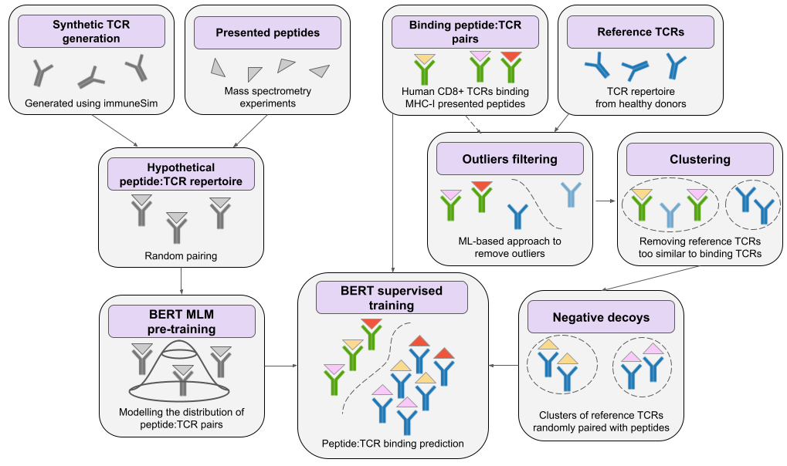

# BERTrand - peptide:TCR binding prediction using BERT augmented with random TCR pairing
Alexander Myronov, Giovanni Mazzocco, Paulina Król, Dariusz Plewczynski

## Introduction

Our approach combines the power of NLP with biologically-relevant data-augmentation to produce a model that can predict peptide:TCR binding

The training process consists of 3 steps:
1. Pre-training - generating a simulated peptide:TCR repertoire and training BERT MLM
2. Negative decoys - randomly pairing peptides from the training set with reference TCRs
3. BERT supervised training for peptide:TCR binding prediction

The detailed flow of the analysis can be seen below.



## Installation

Create a conda environment using a provided env.yml
> conda create -f env.yml

Next, activate the created environment
> conda activate bertrand

You're good to go. 

## Data

The data in this repository comes from public sources - peptide:TCR binding databases and publications and is already curated, 
filtered and combined into a single dataset.

For more details on tha data curation process, see `bertrand/notabooks/data-curation`.

A few useful files:
- `data/phla_tcr_all.csv.gz` contains the filtered and combined dataset of peptide:TCR binders
- `data/phla_tcr_unique.csv.gz` contains the dataset of unique peptide:TCR binders (grouped by peptide, CDR3beta and MHC type)
- `results/negative_decoys/datasets` contains the unique binders dataset augmented with random reference TCRs, ready for model training and evaluation. The reference pairing is repeated for 3 different random seeds. 

Our evaluation approach is repeated cross-validation. The dataset is split into cancer and viral subsets. The cancer subset is used as an independent test set and the viral part 
is further split into train, validation (used for early stopping), and test sets. 
If you want to recreate the splits yourself, use the snippet below:
```python
import pandas as pd
from bertrand.training.cv import split_train_val_test

dataset = pd.read_csv('results/negative_decoys/datasets/dataset_42.csv.gz')
cancer = dataset[dataset.is_cancer]
train, val, test = split_train_val_test(dataset, cv_seed=42) 
```

## Analysis

(The various parts of the training process are called using bash scripts. You are free to call them directly, if you so desire)

The script `analysis.sh` lets you run everything. Simply run the script with 2 arguments: 
1. output folder,
2. number of CPUs for the job.
```
bash analysis.sh results 32
```

`analysis.sh` simply calls 3 separate scripts for each step of the training process (see above). 
Note that some parts of the analysis are CPU and RAM intensive, while other need a good GPU to complete in a reasonable time, so you might want to run them on different machines.


The analysis pipeline will create a directory structure in your results folder. The important files are:
```
<results directory>/
├─ pretraining/                            
│  ├─ model/                    MLM model best checkpoint
│  │  ├─ pytorch_model.bin
│  │  ├─ config.json
├─ negative_decoys/             Peptide:TCR datasets ready for training
│  │  ├─ dataset_42.csv.gz
│  │  ├─ dataset_43.csv.gz
│  │  ├─ dataset_44.csv.gz
├─ training/
│  ├─ dataset_42/
│  │  ├─ cv_seed=42/            Model weights and predictions for every cross-validation split 
│  │  │  ├─ best-checkpoint/
│  │  │  ├─ predictions.pkl
│  │  │  ├─ metrics.png
│  │  ├─ cv_seed=43/
│  │  ├─ ...
│  ├─ dataset_43/
│  │  ├─ cv_seed=42/
│  │  ├─ ...
│  ├─ results.csv               Results of cross-validation in a single file

```
Most of the scripts cache intermediate results (distance matrices, model checkpoints etc), these are omitted for brevity. 

### Pre-training
```
bash pretraining.sh <results>/pretraining
```
This script will create a `pretraining` subdirectory in your results directory and will call the following python scripts:
1. `peptide_tcr_repertoire.py` - create the peptide:TCR repertoire from simulated CDR3b sequences randomly paired with presented peptides
2. `train_mlm.py` - pre-train BERT with masked language modeling on the said repertoire (GPU intensive)
3. `evaluate_mlm.py` - choose the best model checkpoint and save it to `pretraining/model`

### Negative decoys
```
bash negative_decoys.sh <results>/negative_decoys <num of CPUs>
```

This script will create a `negative_decoys` subdirectory in your results directory and will call the following python scripts:
1. `basic_filtering.py` - retain reference TCRs 10-20 amino acids long with proper anchor positions
2. `outliers_filtering.py` - remove easily detectable reference TCRs (CPU intensive)
3. `compute_distance.py` - compute pairwise Levenshtein distances (RAM intensive)
4. `tcr_clustering.py` - perform agglomerative clustering (RAM and CPU intensive)
5. `assign_clusters_and_filter.py` - assign cluster and remove reference TCRs in clusters with binding TCRs
6. `negative_decoys_generation.py` - randomly pair reference TCR clusters with peptides from the positives dataset

Negative decoys generation is random, so it's best to generate more than one dataset. 
`negative_decoys_generation.py` will do it for you for a number of `--n-splits` different random seeds.
`negative_decoys/datasets` will contain datasets ready for supervised training of BERT. 
`negative_decoys/cache` will contain intermediate results - distance matrices, clustering linkage, outliers filtering results etc. 


### Training
```
bash train_and_evaluate.sh <results>/negative_decoys/datasets <results>/pretraining/model <results>/training
```
This script will create a `training` subdirectory in your results directory and will call the following python scripts:
1. `train.py` - train BERT using repeated stratified cross-validation (GPU intensive)
2. `evaluate.py` - choose best model based on early-stopping set, compute predictions for independent cancer set, save results for all datasets and cv splits to a single file 

### Inference
There are several options for inference. If you want to generate predictions for a dataset of peptide:TCR observations, you can use `bertrand/model/inference.py`
```
python -m bertrand.model.inference -i=<input> -m=<model> -o=<output>
```
where `<input>` is a .csv or .csv.gz file with `peptide_seq` and `CDR3b` columns and `<model>` is a BERTrand checkpoint. The prediction will be written to `<output>` as a csv file.  

The same thing can be done programmatically by calling `get_dataset_predictions`. 
This function uses pytorch-lighting interface to generate the predictions. If you want a prediction for a single peptide:TCR pair, 
you can call `get_single_prediction`, which doesn't involve pytorch-lightning. 

The above functions convert logits to probabilities and don't return anything else. In case you want to get logits or attention outputs, you will have to do the inference yourself. 
This is pretty trivial, below is a minimal example to get logits, attention ouputs and hidden states.


```python
model = BERTrand.from_pretrained(args.model)
model.eval() # don't forget this
input = PeptideTCRDataset.encode_peptide_cdr3b("ELAGIGLTV", "CASSGRGQEYF")
input = single_obs_to_tensor(input)
logits, attentions, hidden_states = model(**input, output_attentions=True, output_hidden_states=True)

```


